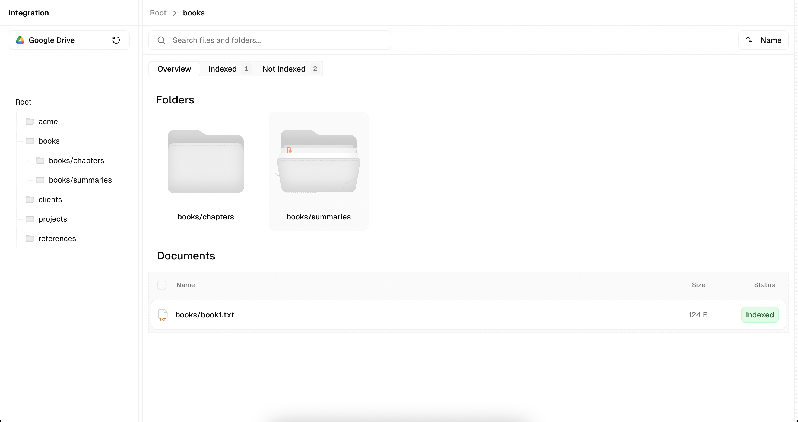

# File Picker



## [stack]

- **Next.js 15.5.3** - React framework with App Router and Turbopack
- **TypeScript** - Type safety and developer experience
- **Tailwind CSS** - Utility-first styling
- **SWR v2** - Data fetching with intelligent caching
- **Radix UI** - Accessible component primitives
- **shadcn/ui** - Pre-built component system
- **Sonner** - Toast notifications
- **Lucide React** - Icon library

### [architecture + design]

1. **modular**
```
components/
├── FileList/           # File listing and row components
├── ui/                # shadcn/ui base components
├── FilePickerLayout.tsx # Shared layout component
├── Sidebar.tsx        # Connection management
└── FileContentDrawer.tsx # File preview drawer
```

**why**: promotes reusability, maintainability, and follows single responsibility principle.

2. **custom hooks pattern**
```
hooks/
├── useConnectionSync.ts  # Connection state management
├── useFileDrawer.ts     # Drawer state management
├── useFolderListing.ts  # Data fetching with SWR
├── usePathMapping.ts    # Path-to-ID mapping
└── useSearchSort.ts     # Search and sort state
```

**why**: Separates business logic from ui, and promotes code reuse.

3. **optimistic ui**
- immediate visual feedback for user actions
- automatic rollback on API errors
- smart cache invalidation with SWR

**Why**: provides responsive feel, reduces perceived latency, and improves user experience.

4. **caching**
```typescript
// Cache key pattern: ['drive', connectionId, folderId, { sort, q, pageToken }]
const key = generateFolderCacheKey(connectionId, resourceId, params)
```

**Why**: consistent cache keys to reduce API calls.

5. **accessibility**
- semantic HTML elements
- ARIA labels and roles
- keyboard navigation support
- screen reader compatibility

**Why**: inclusive design, legal compliance, and better user experience for all users.

### [getting started]

**prerequisites**
- Node.js 18+
- pnpm (recommended) or npm

***installation**

1. **clone the repository**
```bash
git clone <repository-url>
cd file-picker
```

2. **install dependencies**
```bash
pnpm install
```

3. **environment setup**
Create a `.env.local` file with your StackAI credentials:
```bash
NEXT_PUBLIC_STACKAI_EMAIL='your-email@example.com'
NEXT_PUBLIC_STACKAI_PASSWORD='your-password'
```

4. **run the development server**
```bash
# development
pnpm dev          # start development server
pnpm build        # build for production
pnpm start        # start production server

# code Quality
pnpm lint         # run Biome linter
pnpm format       # format code with Biome
pnpm type-check   # run TypeScript type checking

# testing
pnpm test         # run unit tests
pnpm test:watch   # run tests in watch mode
```

5. **Open your browser**
Navigate to `http://localhost:3000`

### [api]
The app uses StackAI endpoints for Google Drive integration. Update the API configuration in:
- `lib/api.ts` - API client implementation
- `jupyter.ipynb` - Contains actual endpoint documentation

### [testing]

```bash
# Run tests
pnpm test

# Watch mode during development
pnpm test:watch
```

### [known limitations]

1. **large folders**: consider implementing virtualization
2. **file size**: large file previews may impact performance
4. **browser support**: optimized for modern browsers (ES2020+)
